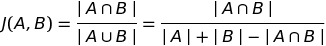
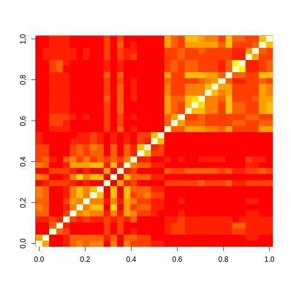
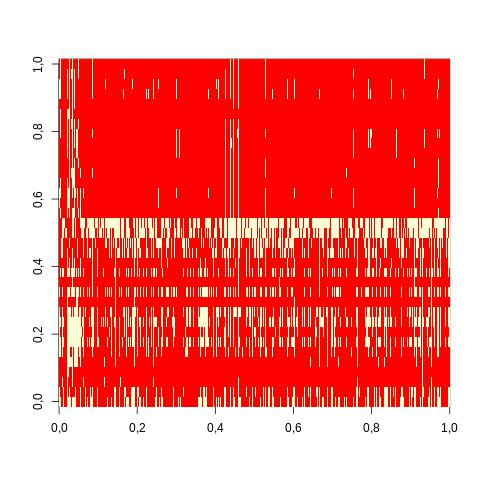

# ChIP-Pipeline
# ChIP-Pipeline
## Workflow


The pipeline requires Input files in BED- or BED6-format. For now, the Pipeline accepts output from ChIP-Atlas and formates files to BED-format. Input as .tsv looks like this (showing one line):
```
track name="EPAS1 (@ All cell types) 50" url="http://chip-atlas.org/view?id=$$" gffTags="on"
chr1	9869	10464	ID=SRX968419;Name=EPAS1%20(@%20786-O);Title=GSM1642766:%20ChIP-Seq%20of%20HIF-2a%20in%20786-O%20with%20HIF-1a%20re-expression%3B%20Homo%20sapiens%3B%20ChIP-Seq;Cell%20group=Kidney;<br>source_name=Renal%20Cancer%20Cell%20Line;cell%20line=786-O;transfection=HIF-1a%20(pRRL-HIF-1a);chip%20antibody=HIF-2alpha%20Antibody%20(PM9);	700	.	9869	10464	204,255,0
```
The files generally follow this scheme: 	
| Column        | Description           | Example  |
| ------------- |:-------------:|:-----:|
|   1     | Experimental ID (SRX, ERX, DRX) | SRX097088 |
| 2     | Genome assembly      |   hg19 |
| 3 | Antigen class     |    TFs |
|   4     | Antigen | GATA2 |
| 5     | Cell type class        |   Blood |
| 6 | Cell type    |    K-562 |
|   7     | Cell type description | Primary Tissue=Blood|Tissue Diagnosis=Leukemia Chronic Myelogenous |
| 8     | Processing logs (# of reads, % mapped, % duplicates, # of peaks [Q < 1E-05])      |   30180878,82.3,42.1,6691 |
| 9 | Title     |    GSM722415: GATA2 K562bmp r1 110325 3|
|   10     |Meta data submitted by authors| source_name=GATA2 ChIP-seq K562 BMP cell line=K562 chip antibody=GATA2 antibody catalog number=Santa Cruz SC-9008 |

This line contains all information on one read from the GSM-repository GSM722415, more precise from the experiment SRX097088, such as the chromosome, start- and stop-position, cell line and available metadata. For now, the pipeline extracts the chromosome, start, end and SRX-ID for each read. 


## Functions

ChIP-Atlas provides data in a concatenated format, with all reads from all experiments in one file. This usually results in huge textfiles ( >100 Gb), that cannot be handled by Python very well and/or exceed the available RAM of one workstation. Thus, the Pipeline splits the file in chunks of 10.000.000 lines into smaller files.
### split(), extracting_IDs() and formatting_pipeline_new.py
```sh
extracting_IDs(){
count=1
echo "Extracting IDs..."
line_number=$(wc -l < $FILE_NAME)
split_number=10000000
if (( $line_number < $split_number ));
then
	python3 formatting_pipeline_new.py -i $FILE_NAME >> $FILE_NAME.IDs
else
for a in x*;
	do
	python3 formatting_pipeline_new.py -i $a >> $a.IDs
	count=`expr $count + 1`
	echo "File $count processed."
	done
fi

echo "Finished processing a total of $count ID files." 
cat *.IDs >> "$FILE_NAME.IDs.final"
sort "$FILE_NAME.IDs.final" | uniq > $FILE_NAME.IDs
sed -i '/^$/d' $FILE_NAME.IDs
echo "Finished extracting IDs!"
}
```
These files are then fed into a Python script that extracts all SRX-IDs from the input-file and writes them to a new file. Lastly, it joins all IDs from the split-files and removes duplicates: 

```python
import pandas as pd
import numpy as np
import regex as re
import argparse

parser = argparse.ArgumentParser()
parser.add_argument('-i', required=True, dest="i", help="Specify name of input file.")
args = parser.parse_args()

ID_list=[]

def ID_Check(ID):
    if ID in ID_list:
        return False
    else:
        return True
    
with open(args.i, "r") as file:
    entries = file.readlines()
    for lines in entries:
        gene_ID = "".join(re.findall('ID=(.*?);', lines))
        if ID_Check(gene_ID) == True:
            ID_list.append(gene_ID)            
        else:
            continue
for element in ID_list:
    print(element)
```

## formatting_file()
Next up, the Pipeline removes all excess information from the mainfile to create a BED-file, with four columns for chromosome, start, end and SRX-ID specifying each read. This decreases the file size by a factor of ~8 and thus increases file handling speeds.
```sh
formatting_file(){
line_number=$(wc -l < $FILE_NAME)
split_number=10000000
if(( $line_number < $split_number ));
then
	echo "Formatting file..."
	end_of_file=0
	while [[ $end_of_file == 0 ]]; do
  		read -r line
  		end_of_file=$?
		grep SRX | cut -f 1-4 | sed 's/;/\t/g' | cut -f 1-5 | sed 's/ID=//g' |  sed 's/Name=//g' | sed 's/%20(/\t/g' | cut -f 1-5 >> temp
		
	done < "$FILE_NAME"
	echo "File formatted."
else
	echo "Formatting file..."
	for b in x*;
	do
		end_of_file=0
		while [[ $end_of_file == 0 ]]; do
  			read -r line
  			end_of_file=$?
			grep SRX | cut -f 1-4 | sed 's/;/\t/g' | cut -f 1-5 | sed 's/ID=//g' |  sed 's/Name=//g' | sed 's/%20(/\t/g' | cut -f 1-5 >> temp
			
		done < "$b"
	echo "File formatted."
	done
fi
}
```
## creating_experiment_files()
Next, the Pipeline creates a separate file for each SRX-ID present in the mainfile and proceeds to extract each read for a given SRX-ID into the respective file.

```python
               +----------->  SRX19382
+--------------+
|              +----------->  SRX19383
|  GSM722415   |
|              +----------->  SRX19384
+--------------+
               +----------->  SRX19385

```
_Fig. 1: Extracting SRX files from the mainfile._


```sh
creating_experiment_files(){
echo "Creating experiment files..."
INPUT_FILE="temp"
count1=0
while IFS= read -r line
	do	
		OUT_FILE="$line.bed"
		grep "$line" $INPUT_FILE | cut -f 1-5  >> "$OUT_FILE"
		count1=`expr $count1 + 1`
	done < "$FILE_NAME.IDs"
echo "Done. A total of $count1 experiment files was created."
}
```
## Analysis Functions
## Jaccard-Matrix
When analyzing multiple ChIP-seq experiments, an overall plot of similiarities between single experiments can indicate factors targeting similiar genomic regions or sites. Rather than comparing intersects, one would like to compare the *grade of similiarity*, which can be calculated from the area of overlap divided by the area of union - this is known as the Jaccard Index: <br/><br/> 

<br/><br/>
The Jaccard statistic is used in set theory to represent the ratio of the intersection of two sets to the union of the two sets. Similarly, Favorov et al. (2012) reported the use of the Jaccard statistic for genome intervals: specifically, it measures the ratio of the number of intersecting base pairs between two sets to the number of base pairs in the union of the two sets. Here, the ```bedtools jaccard``` tool is implemented to calculate this statistic, which modifies the statistic such that the length of the intersection is subtracted from the length of the union. **As a result, the final statistic ranges from 0.0 to 1.0, where 0.0 represents no overlap and 1.0 represent complete overlap.** To plot the the Jaccard indices of **n** ChIP-seq experiments, the Pipeline creates a two-dimensional matrix with an length **n** and width **n** - As this requires the calculation of **n** <sup> **2**</sup> Jaccard indices, the function rapidly outscales the processing power of the workstation and needs to be parallelized with ```GNU parallel``` for improved scalability.  

```

     d    c    b    a
   +-------------------+        
   |0.1 |0.7 |0.8 |1.0 | a
   +-------------------+
   |0.1 |0.5 |1.0 |0.8 | b           image()
   +-------------------+        +---------------+
   |0.1 |1.0 |0.5 |0.7 | c                      |
   +-------------------+                        |
   |1.0 |0.1 |0.1 |0.1 | d                      |
   +-------------------+                        v
```


## Plotting Coverage

```
 SRX1094                                                                       SRX1094     SRX1095  +->   ...
+-----------------------+			  +-------------------------------------------------------------+
|chr1      199     2041 |                         |chr1      199     2041         1           0
|chr3      55911   59451|    +------------->      |chr1      2849    4822         0           1
|chr5      4280    10234|                         |chr1      32011   34331        0           1
+-----------------------+   multiIntersectBed()   |chr3      55911   59451        1           0
                                                  |chr5      4280    10234        1           0
 SRX1095                           +------->      |chr7      19331   20144        0           1
+-----------------------+          |              |                                     +
|chr1      2849    4822 |          |              |                        +            |
|chr1      32011   34331|   +------+              +	    matrix()       |            v
|chr7      19331   20144|                             +--------------------+
+-----------------------+                             |     image()                    ...
                                                      |
                                                      v
```

<br/><br/>
## Sample Analysis
In the following, we will use the ChIP-Pipeline to analyze 35 ChIP-Seqs of **EPAS1** (Endothelial PAS domain-containing protein 1), as a sample analysis. Once started, the Pipeline ask to specify the input file and then requires no further interaction. This is the output of the Pipeline in the terminal:
The ```echo``` output resembles the respective steps in the Pipeline:
- Asking for the input file
- Checking the header
- Deciding whether the file should be split
- Extracting all SRX-IDs
- Removing excess data from mainfile
- Creating experiment files
- Intersecting files with G4s
- Calculating Jaccard indices
- Constructing Jaccard matrix
- Rendering matrix plot
- MultiIntersecting & rendering coverage plot

```sh
(base) Oth.ALL.05.EPAS1.AllCell.bed>./ChIP_Pipeline_final.sh 
Enter File name:                        
Oth.ALL.05.EPAS1.AllCell
Header looks good.
File is too small to split.
Extracting IDs...
Finished processing a total of 1 ID files.
Finished extracting IDs!
Formatting file...
File formatted.
Creating experiment files...
Done. A total of 35 experiment files was created.
Intersecting Experiment files with G4s...
Intersecting SRX114493.bed...
Intersecting SRX212355.bed...
Intersecting SRX212356.bed...
Intersecting SRX212357.bed...
Intersecting SRX212358.bed...
Intersecting SRX212363.bed...
Intersecting SRX212365.bed...
Intersecting SRX212364.bed...
Intersecting SRX212366.bed...
Intersecting SRX2346892.bed...
Intersecting SRX3051209.bed...
Intersecting SRX2584128.bed...
Intersecting SRX3346350.bed...
Intersecting SRX359885.bed...
Intersecting SRX3346354.bed...
Intersecting SRX4096727.bed...
Intersecting SRX4802301.bed...
Intersecting SRX4802302.bed...
Intersecting SRX4802309.bed...
Intersecting SRX4802308.bed...
Intersecting SRX4802315.bed...
Intersecting SRX4802322.bed...
Intersecting SRX4802316.bed...
Intersecting SRX4802323.bed...
Intersecting SRX4802335.bed...
Intersecting SRX4802337.bed...
Intersecting SRX4802342.bed...
Intersecting SRX4802344.bed...
Intersecting SRX4802349.bed...
Intersecting SRX4802350.bed...
Intersecting SRX4802363.bed...
Intersecting SRX968415.bed...
Intersecting SRX4802364.bed...
Intersecting SRX968419.bed...
Intersecting SRX968422.bed...
Calculating jaccard indices for 35 files...
Jaccard indices calculated.
-i used with no filenames on the command line, reading from STDIN.
-i used with no filenames on the command line, reading from STDIN.
Constructing matrix...
Matrix constructed.
Rendering matrix plot...
[1] "matrix_final.tsv"
[1] "35"
Read 1225 items
null device 
          1 
Matrix plot rendered.
Cleaning up...
Cleaning finished.
[1] "Oth.ALL.05.EPAS1.AllCell.matrix"
[1] "70"
Read 6047650 items
null device 
          1 
Removing temporary files...
rm: cannot remove 'temp': No such file or directory
Termporary files removed. Exiting.
```
Running the Pipeline took around 20 seconds from start to finish. Before exiting, all intermediary files such as temp files, jaccard matrices, intersect files a. o. are removed, as these are usually not required for further analysis and would only occupate storage space. However, these files can be kept by commenting out the corresponding line in the ``` cleaning()``` function, such as``` #rm intersected.* ```. We then can see 35 distinct SRX-files, containing the reads of each experiment. The ```Output_sorted.txt``` file contains a summary of the G4-intersect for each file, and sorts them according to the relative overlap, descending from the highest overlap. The file is structured as:
| SRX-ID        | Total reads       | Total G4 intersects  |Intersects / Reads |
| ------------- |:-------------:| :-----:|-----:| 
|SRX2346892.bed|90|190|2.1111111111111|
Showing the first ten lines of ```Output_sorted.txt```:
```sh
(base) Oth.ALL.05.EPAS1.AllCell.bed>head -10 Output_sorted.txt 
SRX2346892.bed	90	190	2.111111111111111
SRX968419.bed	202	314	1.5544554455445545
SRX968415.bed	277	297	1.0722021660649819
SRX4802363.bed	2208	1548	0.7010869565217391
SRX3346354.bed	1432	950	0.6634078212290503
SRX4802309.bed	279	185	0.6630824372759857
SRX4802349.bed	1663	928	0.5580276608538786
SRX4802308.bed	204	112	0.5490196078431373
SRX4802350.bed	1510	827	0.547682119205298
SRX4802364.bed	1411	744	0.5272856130403969
```


```
SRX114493.bed  SRX212365.bed   SRX359885.bed   SRX4802316.bed  SRX4802349.bed SRX212355.bed  SRX212366.bed   SRX4096727.bed  SRX4802322.bed  SRX4802350.bed
SRX212356.bed  SRX2346892.bed  SRX4802301.bed  SRX4802323.bed  SRX4802363.bed
SRX212357.bed  SRX2584128.bed  SRX4802302.bed  SRX4802335.bed  SRX4802364.bed
SRX212358.bed  SRX3051209.bed  SRX4802308.bed  SRX4802337.bed  SRX968415.bed
SRX212363.bed  SRX3346350.bed  SRX4802309.bed  SRX4802342.bed  SRX968419.bed
SRX212364.bed  SRX3346354.bed  SRX4802315.bed  SRX4802344.bed  SRX968422.bed 
```
